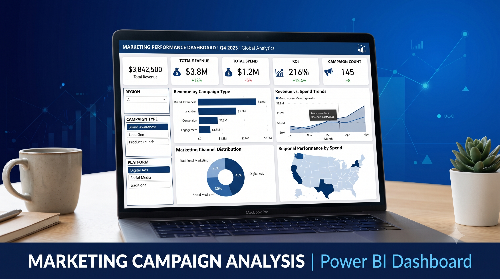

Marketing Campaign Analysis Dashboard | Power BI
📌 Project Overview

This project is a Power BI Marketing Campaign Analysis Dashboard developed to evaluate the performance of marketing campaigns across different regions and marketing channels, including Digital Ads, Social Media, and Traditional Marketing.

The dashboard provides interactive insights into campaign effectiveness by analyzing key business metrics such as Revenue, Marketing Spend, ROI, Campaign Performance, and Regional Performance. The project demonstrates the complete Power BI workflow, from data preparation to dashboard creation.

🎯 Problem Statement

As a Marketing Analyst, the objective is to analyze how different marketing campaigns perform across multiple regions and platforms and present the findings through an interactive Power BI dashboard. The dashboard enables stakeholders to compare campaign performance, identify high-performing regions, and make data-driven marketing decisions.

📂 Dataset

The project uses three CSV files:

Marketing_Campaign_Details.csv
Marketing_Campaign_Performance.csv
Region_Performance.csv

These datasets contain campaign information, performance metrics, and regional marketing data.

🛠️ Project Workflow
1. Data Preparation
Imported all CSV files into Power BI
Cleaned missing values and removed duplicates
Renamed columns for better readability
Corrected data types
Standardized data formats
2. Data Modeling
Created relationships between datasets
Designed an optimized star schema
Managed table relationships for accurate analysis
3. DAX Measures

Created custom measures including:

Total Revenue
Total Marketing Spend
Total Profit
ROI (%)
Average Campaign Performance
Campaign Count
Region-wise KPIs
4. Dashboard Development

Developed an interactive dashboard with:

KPI Cards
Bar Charts
Column Charts
Pie/Donut Charts
Line Charts
Slicers and Filters
Region and Campaign Comparisons
📊 Dashboard Insights

The dashboard helps answer questions such as:

Which campaign type generated the highest revenue?
Which region delivered the best ROI?
How much was spent on each marketing channel?
Which campaigns performed the best?
Revenue vs Marketing Spend comparison
Regional marketing performance analysis
🛠️ Tools & Technologies
Power BI Desktop
Power Query
DAX (Data Analysis Expressions)
Data Modeling
CSV Data Sources
📁 Repository Structure
Marketing-Campaign-Analysis/
│
├── Dataset/
│   ├── Marketing_Campaign_Details.csv
│   ├── Marketing_Campaign_Performance.csv
│   └── Region_Performance.csv
│
├── PowerBI/
│   └── Marketing Campaign Analysis.pbix
│
├── Dashboard/
│   └── Dashboard Screenshot.png
│
└── README.md
🚀 Features
Interactive Power BI Dashboard
Dynamic KPIs
ROI Analysis
Revenue & Spend Tracking
Campaign Performance Comparison
Regional Performance Analysis
Interactive Filters & Slicers

📸 Dashboard Preview

📈 Skills Demonstrated
Data Cleaning
Data Transformation
Data Modeling
DAX Calculations
Business Intelligence
Dashboard Design
Data Visualization
Marketing Analytics
📌 Learning Outcomes

Through this project, I gained practical experience in:

Preparing and transforming raw marketing data
Building efficient Power BI data models
Writing DAX measures for business KPIs
Designing professional and interactive dashboards
Extracting actionable insights from marketing campaign data

👤 Author

Dileep.T

GitHub: (https://github.com/Dileep-getdata)
LinkedIn: https://www.linkedin.com/in/dileep-t-34704625b/
